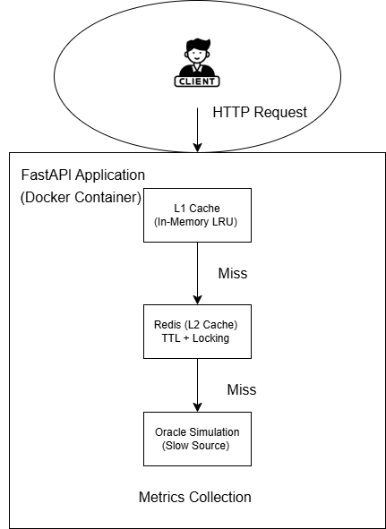

# Multi-Layer Cache System  
**FastAPI . Redis . Docker**

This project implements a **multi-layer caching system** similar to what is used in real-world backend systems to improve performance and reduce load on slow data sources.

The application is built using **FastAPI**, **Redis**, and **Docker**, and demonstrates how **L1 (in-memory)** and **L2 (Redis)** caches work together with a slow backend (Oracle simulation).

---

### Key Features

- FastAPI backend running inside Docker
- **L1 Cache**: Custom in-memory **LRU (Least Recently Used)** cache  
  *(implemented from scratch, no libraries used)*
- **L2 Cache**: Redis with TTL support
- **Slow Data Source**: Oracle simulation using artificial delay
- **Cache Metrics**: Tracks hits, misses, and evictions
- **Cache Stampede Protection** using Redis locks
- Built-in **Swagger UI** for API documentation

---

### Architecture Overview

- L1 cache provides the fastest access
- Redis acts as shared cache with expiration
- Oracle is accessed only when both caches miss
- Data fetched from Redis or Oracle is promoted back to L1

---

### Project Structure
```
multi-layer-cache/
│
├── Dockerfile
├── docker-compose.yml
├── requirements.txt
├── README.md
├── architecture.png
└── app/
├── main.py # FastAPI application
├── oracle.py # Simulated slow data source
├── redis_client.py # Redis connection logic
├── l1_cache.py # Custom LRU cache (L1)
├── metrics.py # Cache metrics tracking
└── lock.py # Cache stampede protection
```
---

## Caching Layers Explained

### L1 Cache (Custom LRU)
- Stored in application memory
- Limited capacity
- Uses dictionary + doubly linked list
- Automatically evicts least recently used items

### L2 Cache (Redis)
- Stores cached data with TTL (30 seconds)
- Shared across requests
- Reduces load on slow backend

### Oracle (Simulated)
- Represents a slow database
- Implemented using `time.sleep(2)`
- Accessed only on cache misses

---

## Cache Stampede Protection

When multiple requests ask for the same key at the same time:
- A **Redis lock** is used
- Only one request fetches data from Oracle
- Other requests wait and reuse cached data
- Lock has TTL to prevent deadlocks

This prevents unnecessary load on the slow data source.

---

## Metrics

The application exposes cache performance metrics.

### Endpoint
GET /metrics

#### Example Response
```json
{
  "l1_hits": 1,
  "l2_hits": 1,
  "cache_misses": 1,
  "l1_evictions": 0
}
```
**Metric Meaning**

l1_hits → Requests served from L1 cache

l2_hits → Requests served from Redis

cache_misses → Oracle calls

l1_evictions → LRU evictions

### API Documentation (Swagger UI)

FastAPI automatically provides interactive API documentation.

**Swagger UI:**
```
http://localhost:8000/docs
```

**ReDoc:**
```
http://localhost:8000/redoc
```

These pages allow you to test all endpoints directly from the browser.
How to Run the Project 
1️. Navigate to the project folder

```
cd multi-layer-cache
```
2️. Build and start the application
```
docker compose build --no-cache
docker compose up
```
### API Usage Examples
Health check
```
curl http://localhost:8000/
```
Fetch data
```
curl http://localhost:8000/data/test
```

First request → slow (Oracle)

Second request → fast (cache)

View metrics
```
curl http://localhost:8000/metrics
```
---
### What I Learned

Designing multi-layer cache architectures

Implementing LRU cache without libraries

Using Redis effectively with TTL and locks

Preventing cache stampede issues

Observing system behavior using metrics

Running backend services using Docker
---
## Conclusion

This project demonstrates a real-world inspired backend caching system with performance optimization, observability, and fault-prevention mechanisms.


